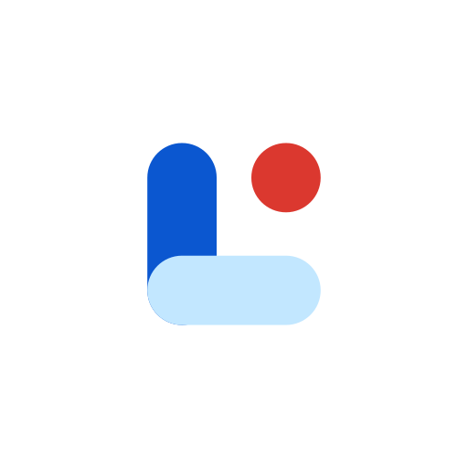

<p align="center">
  
</p>

<h1 align="center">Lomo</h1>

<p align="center">
  English | <a href="README_CN.md">中文</a>
</p>

<p align="center">
  <strong>Local-first Markdown memos on Android — no cloud lock-in.</strong>
</p>

<p align="center">
  <a href="https://github.com/unsigned57/lomo/releases/latest"></a>
  
  
  
</p>

<p align="center">
  <a href="https://github.com/unsigned57/lomo/releases/latest"><b>Download APK</b></a>
  ·
  <a href="docs/sponsor_en.md">Sponsor</a>
</p>

<p align="center">
  
  
  
</p>
<p align="center"><sub>Menu · Home · Detail</sub></p>

## Features

#### Capture

- **Local plain text** — memos are standard Markdown files
- **Voice recording** — capture thoughts hands-free
- **Home screen widgets** — quick capture and recent notes

#### Organize

- **Tags** — organize with `#tags`, including nested tags like `#tag1/tag2`
- **Full-text search** — indexed local search
- **Material 3** — clean UI with dynamic color

#### Review

- **Heatmap** — GitHub-style contribution graph for writing habits
- **Daily review** — flashback to this day in previous years

#### Sync & share

- **S3 backup (recommended)** — object storage with end-to-end encryption
- **Git / WebDAV** — optional built-in backup paths
- **LAN sharing** — share notes to other Lomo devices on the local network

## How should you sync?

Notes live entirely on your device. Pick one path:

1. **S3 (recommended)** — the only built-in option with end-to-end encryption; what the author uses day to day, and the most actively maintained
2. **Any file sync** — Syncthing, Nextcloud, or anything else that syncs the local folder
3. **Git / WebDAV** — built-in backups (WebDAV has mainly been tested with Nutstore)

<details>
<summary>Obsidian / Rclone notes</summary>

Lomo’s S3 sync is compatible with the Obsidian Remotely Save plugin. That plugin has not been actively maintained for a long time, so for Android-to-Android syncing it is better to point Lomo’s S3 sync at the root of your Obsidian vault. Custom folder sync is supported; on Linux, Rclone is usually the better desktop companion.

</details>

## Why Lomo?

I wanted a Memos / Flomo-style lightweight, timestamped capture flow — but **strictly offline**, with local Markdown as the single source of truth. The name is **Lo**cal Me**mo**. Lomo is fully compatible with **Thino** daily-note format, so you can treat it as a native Android client for Thino data.

<details>
<summary>Maintenance & development notes</summary>

**Maintenance:** Lomo is tailored to my own workflow and I use it heavily. As long as it stays in my daily toolchain, I plan to keep maintaining it.

**Development:** This project was built almost entirely with **Google Antigravity** and **Codex**. If you have concerns about AI-generated code stability, feel free to fork and adapt it.

</details>

## Install

1. Download the latest APK from [Releases](https://github.com/unsigned57/lomo/releases/latest)
2. Install on an Android device (Min SDK 26)
3. On first launch, choose a local folder for your memos

Building from source is covered under **Building** below.

## Support

If Lomo is useful to you, you can support the project here: [Sponsor page](docs/sponsor_en.md).

<details>
<summary>Tech stack</summary>

- **Language:** Kotlin
- **UI:** Jetpack Compose (Material 3)
- **Architecture:** MVVM + Clean Architecture (Domain / Data / UI)
- **DI:** Koin
- **Async:** Coroutines & Flow
- **Data:**
  - File-system storage (Storage Access Framework)
  - Room (FTS indexing and cache)

</details>

<details>
<summary>Building</summary>

**Prerequisites:** JDK 26 · Android SDK API 37 · just

```bash
# Build Debug APK
just debug

# Run unit tests
just test

# Full pre-merge gate
just quality
```

Or open the project in Android Studio (Ladybug or newer recommended), use the Kotlin Toolchain project model, and run on an emulator or device.

</details>

## License

This project is licensed under the [GNU General Public License v3.0](LICENSE).
